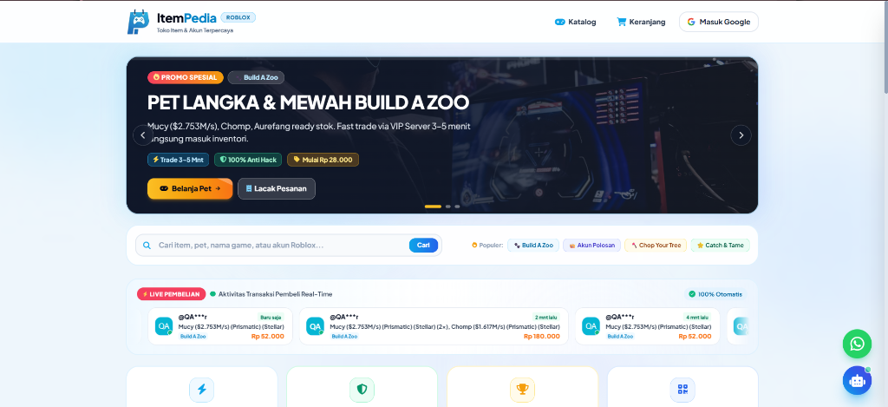
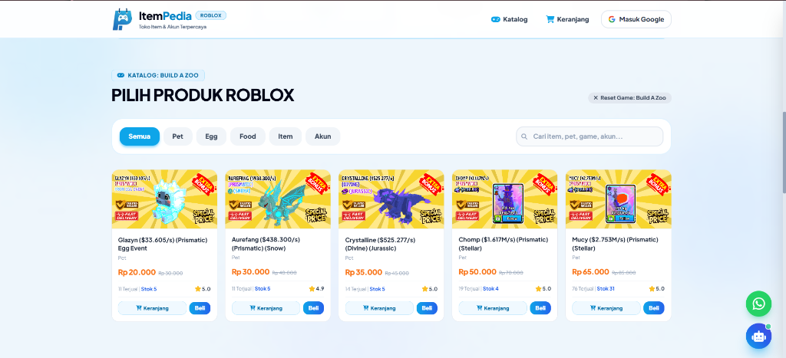

<div align="center">

# 🎮 ItemPedia - Marketplace Item & Akun Roblox

<p align="center">
  <strong>Website e-commerce mandiri & modern khusus jual beli item, pet, dan akun Roblox dengan sistem verifikasi QRIS instan otomatis, Roblox Avatar API, dan panel admin lengkap.</strong>
</p>

[](https://www.php.net/)
[](https://flightphp.com/)
[](https://tailwindcss.com/)
[](https://www.sqlite.org/)
[](LICENSE)

</div>

---

## 📌 Deskripsi Repositori

**ItemPedia** adalah platform marketplace game virtual (*single-seller*) yang dirancang khusus untuk memenuhi kebutuhan transaksi gamer Roblox di Indonesia. Mengusung antarmuka modern ala platform top-up terkemuka (Itemku & Lapakgaming), ItemPedia menghadirkan alur transaksi cepat, aman, dan tanpa ribet.

Dilengkapi dengan integrasi **Roblox Avatar API** untuk memastikan keakuratan username pembeli, **Sistem Pembayaran QRIS Real-Time**, **Live Chat Interaktif Invoice** dengan fitur *1-Click Join Server Roblox*, serta **Panel Admin CMS Terpadu**.

---

## 📸 Preview Antarmuka (Screenshots)

### 1. Hero Promo Banner Slider & Real-Time Marquee
Tampilan beranda dengan promo banner interaktif, toolbar pencarian instan, filter game populer, dan stream transaksi pembeli real-time.



### 2. Multi-Game Hub & Dynamic Catalog Grid
Katalog produk yang terorganisir per game (Build A Zoo, Chop Your Tree, Catch and Tame, Akun Polosan) dengan filter kategori (Pet, Egg, Food, Item, Akun) dan layout 3-kolom mobile yang optimal.



---

## ✨ Fitur-Fitur Unggulan

### 🛍️ Pengalaman Pembeli (Buyer Experience)
- **Multi-Game Selection:** Pilih game favorit dengan mudah; sistem secara otomatis menyesuaikan tab kategori khusus untuk masing-masing game.
- **Hero Promo Carousel:** Slider banner promosi otomatis dengan navigasi panah, touch swipe untuk HP, dan auto-slide timer.
- **Roblox Avatar Checker:** Pengecekan avatar Roblox otomatis saat checkout untuk mencegah kesalahan username tujuan pengiriman item.
- **Shopping Cart & Multi-Item Checkout:** Keranjang belanja interaktif dengan penghitungan subtotal dan potongan kode promo diskon.
- **Sistem Akun Polosan Otomatis:** Akun Roblox polosan bergaransi anti hack-back; data login (username & password) dikirimkan secara rahasia di halaman invoice setelah status transaksi lunas.
- **Live Chat Invoice:** Fitur live chat pembeli-seller langsung di halaman invoice dengan auto-detection link VIP Private Server Roblox (*1-Click Join Server*).
- **Mobile-First Design:** Tampilan responsif sempurna di perangkat mobile (katalog produk 3 kolom rapat & slider horizontal ulasan pembeli).

### 💳 Sistem Pembayaran & Invoice
- **QRIS Instan Semua Bank & E-Wallet:** Mendukung pembayaran via DANA, GoPay, OVO, ShopeePay, LinkAja, BCA, Mandiri, BRI, BNI, dll.
- **Sandbox Mode (Simulasi Pembayaran):** Uji alur transaksi hingga status **PAID** secara instan tanpa menggunakan uang asli.
- **Lacak Pesanan Mandiri:** Pembeli dapat melacak status pesanan kapan saja hanya dengan memasukkan Nomor Invoice.
- **Ulasan & Rating Transaksi:** Pembeli yang telah menyelesaikan transaksi dapat memberikan ulasan dan rating bintang 5 yang tampil langsung di homepage.

### 🛡️ Panel Admin Terpadu (Admin CMS)
- **Dashboard Statistik:** Ringkasan total omset, transaksi sukses, pesanan menunggu proses, dan produk aktif.
- **Manajemen Pesanan (Orders):** Kelola status transaksi (*PENDING, PAID, PROCESSING, SUCCESS, CANCELLED*), 1-klik salin username Roblox, dan kirim data akun.
- **Manajemen Produk (CRUD):** Tambah produk baru, edit harga coret diskon, upload gambar, ganti sub-kategori, dan fitur **Quick-Stock Modifier**.
- **Game & Category Manager:** Tambah dan sesuaikan game Roblox baru beserta kategori custom yang dinamis.
- **Kode Promo (Redeem Codes):** Buat voucher diskon persentase / nominal dengan batas kuota dan masa berlaku.
- **Live Chat Inbox:** Panel obrolan terpusat untuk membalas pesan semua invoice pembeli secara real-time.
- **Moderasi Ulasan & CMS Halaman:** Kelola testimoni pembeli, pengaturan FAQ, dan informasi kontak WhatsApp toko.

---

## 🛠️ Tech Stack

- **Backend:** PHP 8.2 / 8.3 (Native / OOP)
- **Framework:** [Flight PHP](https://flightphp.com/) (Micro-framework super cepat & ringan)
- **Styling:** [Tailwind CSS CDN](https://tailwindcss.com/) & [FontAwesome 6](https://fontawesome.com/)
- **Database:** SQLite (Default / Out-of-the-box) & MySQL / MariaDB (Dual Driver Ready)
- **Font:** Google Fonts (*Plus Jakarta Sans*)

---

## 🚀 Panduan Instalasi Lokal

### 1. Clone Repository
```bash
git clone https://github.com/Theseadev/ItemPedia.git
cd ItemPedia
```

### 2. Konfigurasi Environment (Opsional)
Duplikat file `.env.example` menjadi `.env`:
```bash
copy .env.example .env
```
> **Catatan:** Secara default, ItemPedia langsung berjalan menggunakan database **SQLite** (`database/itempedia.sqlite`) tanpa konfigurasi database tambahan. Jika ingin menggunakan MySQL, atur `DB_CONNECTION=mysql` di file `.env`.

### 3. Install Dependensi Composer
```bash
composer install
```

### 4. Jalankan Server Lokal
Gunakan built-in PHP server:
```bash
php -S localhost:8000 -t public
```

Buka browser Anda dan akses:
- 🌐 **Halaman Utama Toko:** [http://localhost:8000](http://localhost:8000)
- 🔍 **Pelacakan Pesanan:** [http://localhost:8000/lacak](http://localhost:8000/lacak)
- 🔐 **Panel Admin:** [http://localhost:8000/admin](http://localhost:8000/admin)

---

## 🔐 Kredensial Default Admin

| Parameter | Kredensial Default |
|---|---|
| **URL Login** | `http://localhost:8000/admin/login` |
| **Username** | `admin` |
| **Password** | `admin123` |

---

## 🧪 Pengujian Otomatis (QA Test Suite)

ItemPedia dilengkapi dengan rangkaian unit test & end-to-end testing menyeluruh (23 skenario pengujian) untuk memastikan stabilitas transaksi, API avatar, checkout multi-item, alur admin, dan sistem obrolan.

Jalankan pengujian dengan perintah:
```bash
php tests/comprehensive_e2e_test.php
```

---

## 📁 Struktur Direktori

```
ItemPedia/
├── app/
│   ├── config/
│   │   └── database.php          # Database PDO, auto-migrations & seeder
│   ├── controllers/
│   │   ├── AdminController.php   # Manajemen pesanan, produk, promo & chat
│   │   ├── AuthController.php    # Autentikasi admin & pembeli (Google OAuth)
│   │   ├── HomeController.php    # Katalog produk, filter & review stream
│   │   └── OrderController.php   # Checkout, Roblox API avatar & invoice QRIS
│   └── views/
│       ├── admin/                # Template panel admin (Dashboard, Orders, Products, dll.)
│       ├── home.php              # Beranda toko & modal checkout
│       ├── layout.php            # Master layout Tailwind
│       ├── order_detail.php      # Halaman invoice pembayaran QRIS & live chat
│       └── lacak.php             # Halaman lacak transaksi
├── database/                     # Lokasi database SQLite
├── public/
│   ├── index.php                 # Entry point & routing Flight PHP
│   ├── images/                   # Asset logo & logo pembayaran
│   └── uploads/                  # Asset gambar produk
├── screenshots/                  # Tangkapan layar untuk README
├── tests/                        # Automated test suites
├── composer.json
├── .env.example
├── .gitignore
└── README.md
```

---

## 📄 Lisensi

Proyek ini dirilis di bawah lisensi [MIT License](LICENSE). Bebas digunakan dan dikembangkan lebih lanjut untuk keperluan komersial maupun personal.

<div align="center">
  <sub>Dikembangkan dengan ❤️ untuk Komunitas Gamer Roblox Indonesia.</sub>
</div>
